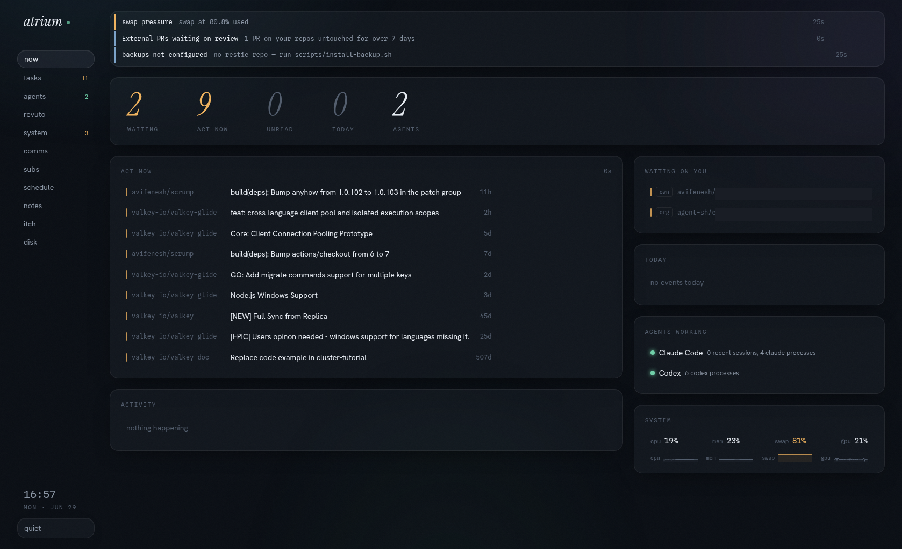

# atrium

A zero-dependency, self-hosted life dashboard for one machine and one human — GitHub tasks, local AI agents, system health, email/calendar, subscriptions, cron, and backups on one screen, with an MCP server so an LLM can read it too.

A small Node daemon polls the things already running on your box into a single in-memory snapshot, serves it over REST + SSE to a web UI, and exposes it to LLMs over MCP. It is **loopback-only by design**: no auth layer, no cloud, no account — it binds `127.0.0.1`, refuses to start on any non-loopback host, and your data never leaves the machine. One idea throughout: anything noisy can be muted, visually (`ui`) or for real (`enforced` — the source itself is paused).



*The `now` view: act-now GitHub tasks, who's waiting on you, agents working, and live system health — one screen, calm by default. (Some labels redacted for the screenshot.)*

**Stack:** Node ≥ 24 · TypeScript · React · systemd user service · MIT licensed · zero runtime dependencies.

## Why this project

- **Use it when** you live across GitHub, local AI agents, and a handful of services, and want one calm screen instead of ten tabs — without sending anything to a cloud dashboard.
- **Use it when** you want a dashboard you fully own: it runs on loopback as a systemd user service, reads only local files and CLIs, and keeps secrets out of every surface.
- **Use it when** you want an LLM (Claude Code, Cursor, any MCP host) to answer "what needs my attention?" — atrium exposes the whole snapshot over MCP with read-only tools it can auto-run.
- **Use it when** you want to bolt your own data source onto a dashboard: a plugin collector is one file and renders with no UI code.

## Installation

Requires **Node ≥ 24** and a **Linux user systemd session**.

```sh
git clone https://github.com/avifenesh/atrium && cd atrium
./scripts/install.sh        # npm install + build + generate & start the systemd user unit
# open http://127.0.0.1:5599
```

`install.sh` renders `scripts/atrium.service.in` with the current `node` path and repo
location, so an nvm upgrade just needs a re-run.

Optional — register the MCP server with your MCP host (the bundled script writes an
`mcp.json` entry; it targets `~/.eigen` by default, adapt the path for Claude Code / Cursor / etc.):

```sh
node scripts/register-eigen.mjs
```

## Quick start: make it yours

Out of the box atrium runs the **core** collectors, but most need to know *who you are*.
None of that lives in the repo — it comes from `~/.config/atrium/config.json`, deep-merged
over the defaults. A minimal config:

```jsonc
{
  "github": {
    "login": "your-gh-username",
    "ownOrgs": ["your-org"],       // repos here count as "your repos"
    "noiseOrgs": []                // orgs excluded from authored-issue noise
  },
  "watchedUnits": ["my-service.service"],  // systemd --user units in the system view
  "notify": {
    "enabled": true,
    "sendCmd": ["ntfy", "publish", "my-topic"]   // argv; the alert message is the last arg
  }
}
```

Restart (`systemctl --user restart atrium`) and the dashboard fills in. `sendCmd` is any
program that takes a message as its final argument (ntfy, a webhook script, …) — see
[examples/notify](examples/notify/). Empty `sendCmd` = push off; the flag still shows in
the UI. Full key reference: [docs/config.md](docs/config.md).

## Features

- **One snapshot, many sources** — GitHub (tasks/PRs/mentions/org queue), system health (CPU/mem/swap/GPU/disks/ports/units), schedule (cron + timers), email/calendar, subscriptions, notes, cloud, backups — each polled on its own interval, failure-isolated.
- **Global quiet switch** — mute anything visually, or `enforced` to actually pause the upstream source. Muted items archive, they don't clutter.
- **Live, no reload** — full snapshot then per-section deltas over SSE; sparklines survive daemon restarts.
- **MCP-native** — an LLM host can read the whole dashboard through `atrium_*` tools; query tools carry `readOnlyHint` so they auto-run in gated mode.
- **Pluggable collectors** — drop a one-file collector into the `extra` lane and it renders in a generic panel with no React. Disable any collector (core or plugin) with one config line; its data *and* its nav tab disappear.
- **Phone alerts that respect you** — crit flags ping a backend of your choice, throttled (one ping per flag per window) with a matching clear notice on recovery.
- **One workspace, independent systems** — the bundled Streampile and LLM Wiki views live in the Atrium shell while their ranking, storage, and artifact generation stay in their own backends. One browser endpoint, no copied domain logic.

## Core concepts

- **Collector** — one module (`{ name, intervalMs, run() }`) that polls a source and writes the store. Core collectors write a typed snapshot section; plugin collectors write a generic `extra` lane.
- **Snapshot** — the single in-memory state object served over REST/SSE and MCP.
- **Flag** — a surfaced condition (`info`/`warn`/`crit`); crit flags can page you.
- **Mute** — `ui` (hide in dashboard) or `enforced` (pause the real source).

The web UI is a keyboard-driven set of views: number keys switch, `/` or `cmd+k` open the
fuzzy command palette, `q` toggles the quiet drawer, `esc` closes the topmost overlay.
Views deep-link via URL hash (`#system`, `#tasks`) for desktop launchers.
The workspace views use `#streampile` and `#knowledge`; both are served through the same
Atrium endpoint. See [docs/workspace.md](docs/workspace.md) for the boundary between repos.

## Writing your own collector

A plugin collector is one file that writes the generic `extra` lane via
`store.setExtra()` and renders automatically — no UI code. Copy a template from
[`examples/collectors/`](examples/collectors/) (disk-usage, http-service), register it, and
it appears as a view. Full contract + worked example: [docs/collectors.md](docs/collectors.md).

Among the built-in bespoke collectors, one is reusable on its own:
**[revuto](https://github.com/avifenesh/revuto)** — a local, supplier-agnostic autonomous
PR reviewer that learns from maintainer feedback. Clone it, point `config.revuto.snapshotUrl`
at its local endpoint, and the `revuto` collector surfaces it in atrium.

## Limitations / tradeoffs

- **Linux + user systemd only.** No macOS/Windows service path; the daemon also assumes a loopback bind.
- **No auth, on purpose.** The threat model is "never reachable" — it refuses non-loopback hosts. Do not put it behind a reverse proxy to share it; that breaks the security model.
- **Single user, single machine.** No multi-tenant, no remote aggregation.
- **Some collectors are the author's.** itch, surreal, eigen, hermes, grok, any-mission and several agent sub-sources integrate tooling specific to the author's machine — disable them (`collectors.disabled`) unless you adapt their source. The core nine work on any Linux box.

## API surface

For scripting or building on atrium, the daemon exposes:

| group | routes |
| --- | --- |
| snapshot | `GET /api/health` · `GET /api/snapshot` · `GET /api/stream` (SSE) · `POST /api/refresh/:collector` |
| mutes | `POST /api/mutes` · `DELETE /api/mutes/:id` |
| agents | `POST /api/agents/:id/:action` · `POST /api/eigen/dispatch` |
| github | `GET /api/github/item` · `POST /api/github/comment` · `POST /api/notifications/read` |
| notes | `GET /api/notes/read` · `POST /api/notes/write` (optimistic concurrency, 409 on conflict) |
| google | `GET /api/google/status` · `GET /api/google/auth-url` · `GET /api/google/callback` |
| spotify | `POST /api/spotify/client` · `GET /api/spotify/auth-url` · `GET /api/spotify/callback` |
| streampile | `GET /api/streampile/feed` · `GET /api/streampile/health` · `POST /api/streampile/event` |
| wiki | `GET /workspace/wiki` (latest generated graph artifact) |

Plugin collectors may register their own routes (the bundled itch plugin proxies `/api/itch/*`).

## Security model

Safety comes from never being reachable, not from a login:

- binds `127.0.0.1` only and refuses any non-loopback host — the eigen dispatch route spawns an agent with your credentials, so LAN exposure is never acceptable
- strict `Host` allowlist (DNS-rebinding defense) and same-origin-or-absent `Origin` on every state-changing method (CSRF defense)
- secrets never enter the snapshot, SSE stream, logs, or error responses; token files are written `0600` with atomic renames; process command lines are redacted before entering the snapshot
- all subprocess calls are argv-array `execFile`/`spawn` (no shell), validated on every user-reachable argument

## Architecture

```
 core collectors (github · system · schedule · comms · subs · notes · cloud · backup · repos)
 plugin collectors (your own — see examples/collectors/)
     │  poll on intervals, failure-isolated
     ▼
   store ── in-memory Snapshot + flags + mutes
     │
     ├── REST  /api/*
     └── SSE   /api/stream (full snapshot, then per-section deltas)
            │
   ┌────────┴─────────┐
   ▼                  ▼
 workspace UI      mcp (stdio, atrium_* tools)
   │
   ├── native Atrium views
   ├── Streampile view ── narrow proxy ── FastAPI / SurrealDB
   └── Knowledge view ── generated viewer ── llm-wiki
```

The daemon also serves the built web UI (`index.html` `no-cache`; content-hashed `assets/`
cached a year). Data the daemon writes lives in `~/.config/atrium/`; nothing is written
inside the repo at runtime.

## Docs

- Configuration reference — [docs/config.md](docs/config.md)
- Writing a collector — [docs/collectors.md](docs/collectors.md)
- Design language — [DESIGN.md](DESIGN.md)
- Workspace composition — [docs/workspace.md](docs/workspace.md)

## Contributing

Contributions that keep atrium zero-dependency, self-hosted, and loopback-only are welcome.
See [CONTRIBUTING.md](CONTRIBUTING.md) for layout, build, and the ground rules
(loopback-only, no secrets in the snapshot, no shell). Build all three workspaces with
`npm run build` before opening a PR.

## License

MIT — see [LICENSE](LICENSE).
